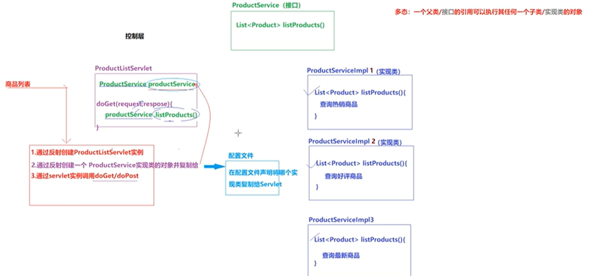
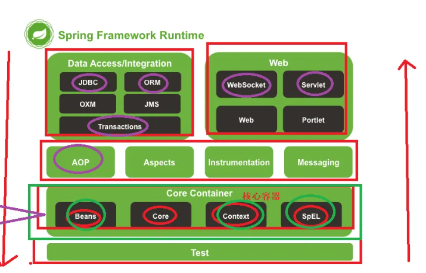

# 一、初识Spring
* 官网：https://spring.io
* Spring 是分层的JavaSE/EE应用full-stack<span style="color:red;font-weight:800;">轻量级开源框架，以ioc（反转控制）和AOP（面向切面编程）的容器</span>
  * 轻量级：体积小，对代码无侵入性
  * 控制反转ioc(inverse of control)：把创建对象的工作交给Spring来完成，Spring在创建对象的时候同时可以完成对象属性赋值
  * 面向切面AOP(Aspect Oriented Programming)：可以在不改变原有业务逻辑的情况下实现对业务逻辑的增强。
  * 容器：实例的容器，管理创建的对象
* 提供展现层SpringMV和持久层Spring JDBCTemplate以及业务层事务管理等总舵企业级应用技术
* 整合开源众多第三方框架和库，逐渐成为使用最多的JavaEE企业级开源框架
* Rod Johnson(Spring 之父)
## 1.1Spring的优势

```java
// 定义接口
    public interface ProductService{
  
  }
```
```java
  //实现类1
    public class ProductServiceImpl1 implements ProductService{
    public list<Product>listProducts(){
    //查询热销商品
  }
  }
```
```java
  //实现类2
    public class ProductServiceImpl2 implements ProductService{
    public list<Product>listProducts(){
    //查询好评商品
  }
  }
```
```java
  //Servlet中
    public class ProductServlet extends HttpServlet{
        //在Servlet中使用new关键字创建ProductServiceImple1对象，增加了servlet和service的耦合度
        private ProductService newProductService = new ProductServiceImple1();
        protected void doGet(HttpServletRequest request, HttpServletResponse response){
            doPost(request, response);
        }
        protected void doPost(HttpServletRequest request, HttpServletResponse response){
            newProductService.listProducts();
        }
  }
```
* <span style="color:red;font-weight:800;">在service实现类中调用DAO中的方法，也需要在Service实现类中通过new创建DAO实现类对象</span>
* <span style="color:red;font-weight:800;">使用new关键字创建对象的弊端</span>
    * 失去了面向接口编程的灵活性
      * 代码的侵入性增强，增加了耦合度，减少了灵活性
* 方便解藕，简化开发（面向接口编程）
  * 通过Spring提供的IoC容器，可以将对象的依赖关系交由Spring进行控制，避免硬编码所造成的过度耦合
  * <span style="color:red;font-weight:800;">在Servlet中定义service接口对象时，不使用new关键字创建实现类对象变量，在Servlet实例化的时候通过反射机制动态给Service对象变量赋值。</span>
  * <span style="color:red;font-weight:800;">通过Spring实现：在配置文件中配置</span>
```java             
//解决耦合，面向接口编程
```
* AOP编程支持
  *方便进行切面编程，许多不容易的传统OOP实现的功能可以轻松通过AOP实现 
* 声明式事务的支持
  *通过声明式方式灵活进行事务管理，提高开发效率和质量
* 方便程序测试
* 方便集成各种优秀框架
* 降低 JavaEE API 的使用难度
* Java源码是经典学习案例
## 1.2Spring开发步骤
1. 导入Spring开发的基本包坐标
2. 编写Dao接口和实现类
3. 创建Spring核心配置文件
4. 在Spring配置文件中配置UserDaoImpl
# 二、Spring 架构

## 2.1Core Container( 核心容器)
- 用于实例的创建和管理
> core
> Beans：实例管理
> Context 容器上下文
## 2.2 AOP Aspects  
> Spring AOP组件，实现面向切面编程
> aop
> aspects
## 2.3 Web
> Spring Web组件指的是SpringMVC框架，实现项目的MVC控制
> 1.web:Spring对Web项目的支持
> 2.Webmvc:SpringMVC组件
## 2.4 Data Access 
> Spring 数据访问组件，也是基于JBDC封装的持久层框架
> （即使没有mybatis,Spring也可以完成持久化操作）
> tx
## 2.4 Test（Spring单元测试组件，提供了Spring下的单元测试）
> Test
# 三、Spring IoC
## 3.1框架部署

